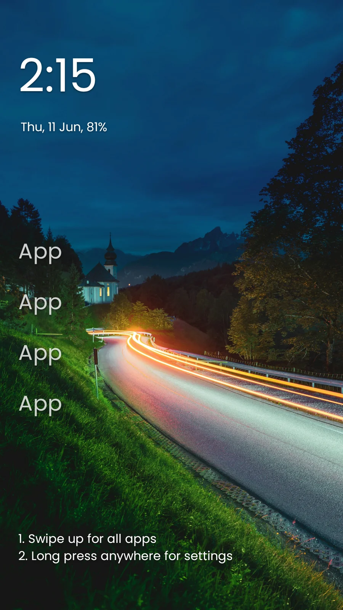
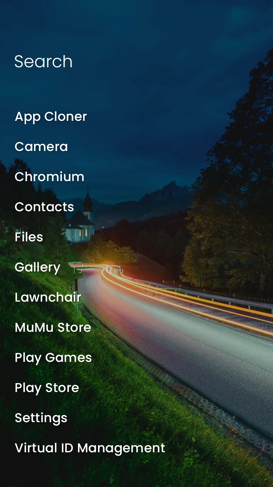
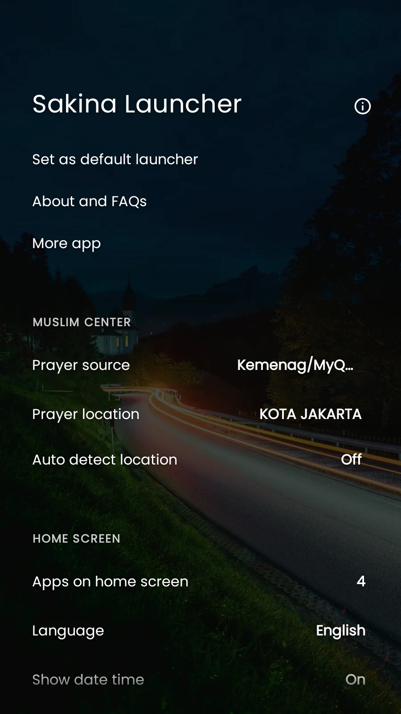
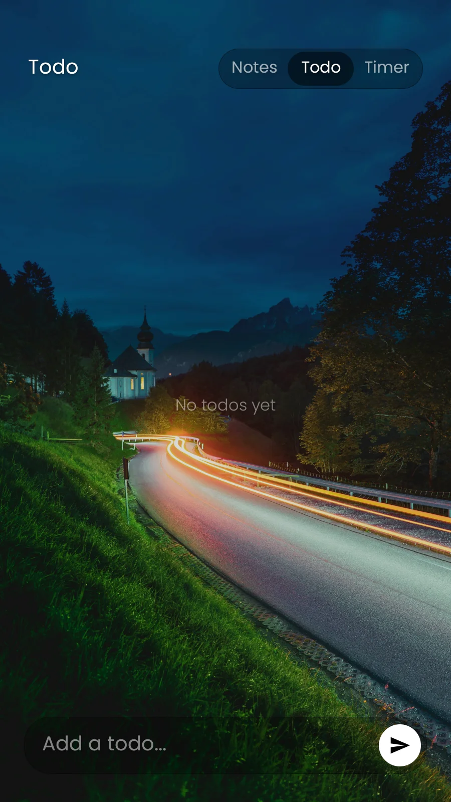
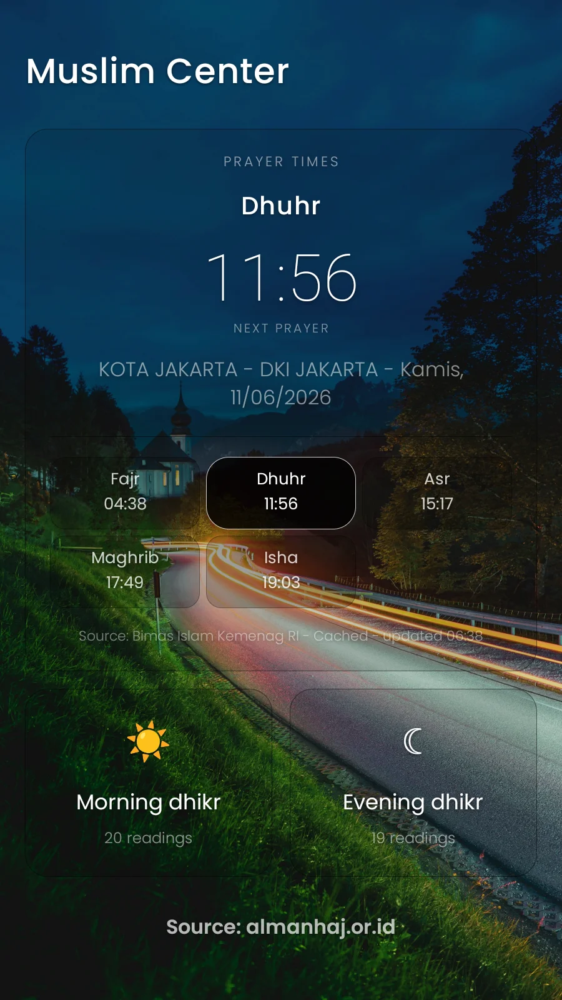
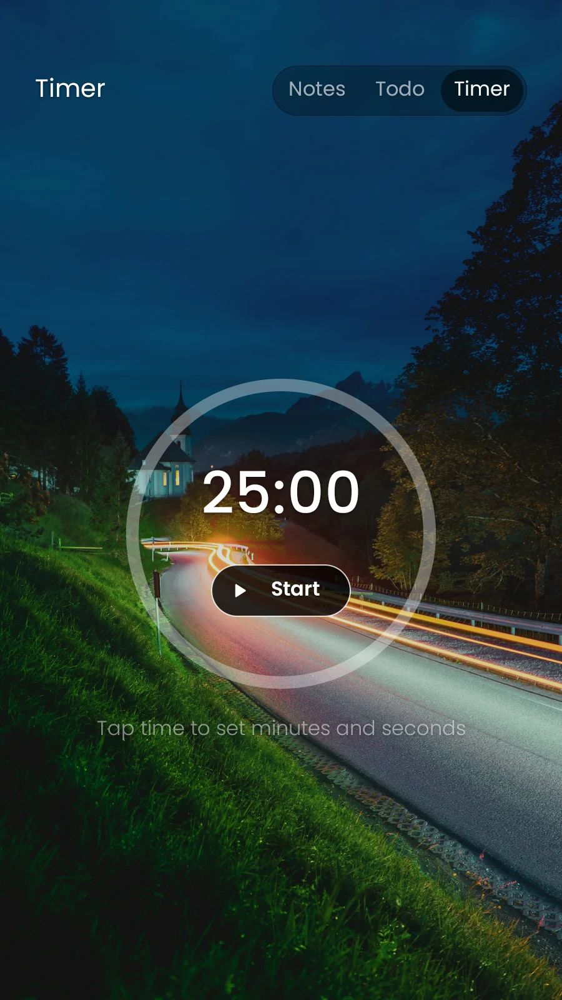

<div align="center">

# 🕌 Sakina Launcher

### A minimal, distraction-free Android launcher with a calm Islamic heart ☪️

Quiet home screen. Prayer times, dzikir, notes, todos and a focus timer — all one gesture away.

<br/>


<br/><br/>


</div>

---

## 📑 Table of Contents

- [Introduction](#-introduction)
- [Features](#-features)
- [Preview / Screenshots](#-preview--screenshots)
- [Built With / Tech Stack](#-built-with--tech-stack)
- [Installation](#-installation)
- [Build From Source](#-build-from-source)
- [Project Structure](#-project-structure)
- [Contributing](#-contributing)
- [Credits](#-credits)
- [License](#-license)

---

## 📖 Introduction

**Sakina Launcher** is a minimal Islamic Android launcher built on top of
[Olauncher](https://github.com/tanujnotes/Olauncher). It keeps the privacy-first,
distraction-reducing home screen of Olauncher and layers a calmer set of daily utilities on
top — a **Muslim Center** with prayer times and dzikir, plus notes, todos and a focus timer.

The name *Sakina* (سَكِينَة) means tranquillity. The whole launcher is designed around that
idea: a quiet text-only home screen, gestures instead of grids of icons, and the few tools
you actually open every day kept a single swipe away.

> [!NOTE]
> Sakina is a fork-based project. The launcher foundation comes from
> [Olauncher](https://github.com/tanujnotes/Olauncher) by
> [@tanujnotes](https://github.com/tanujnotes). Sakina adds the Muslim Center, the productive
> panel, custom fonts (Poppins + Amiri Quran) and a refreshed UI.

> [!TIP]
> After installing, press **Home** and choose **Sakina Launcher** as your default launcher to
> get the full experience.

---

## ✨ Features

### 🌙 Quiet Launcher
- Minimal, text-first home screen with up to 8 favourite apps.
- Swipe gestures (left / right / down) mapped to apps, app drawer, notes, todos, timer and the Muslim Center.
- Hidden apps and app renaming.
- Light, dark and system theme modes.
- Optional screen-time display via Usage Stats.

### 🕋 Muslim Center
- Five daily prayer times (Fajr, Dhuhr, Asr, Maghrib, Isha).
- Indonesian source (Kemenag / MyQuran) and global source ([Aladhan](https://aladhan.com/prayer-times-api)).
- Manual city search or automatic location.
- Cached schedule for offline use.
- Morning and evening **dzikir** cards with a built-in tap repetition counter (Amiri Quran mushaf font for Arabic).

### 📝 Productive Panel
- Chat-style notes with floating tap actions (delete, edit, copy, done, close).
- Todo list with multi-select batch delete and done state.
- Focus / Pomodoro timer with circular progress.
- Keyboard-aware panel — rises above the IME, never hidden behind it.

### 🔒 Privacy
- No ads. No analytics. No account. Your data stays on the device.

> [!IMPORTANT]
> Usage Stats and Location permissions are **optional**. Usage Stats is only used for the
> screen-time display, and Location is only used to auto-detect your prayer-times city. The
> launcher works fully without granting either.

---

## 📸 Preview / Screenshots

<div align="center">

| Home | App Drawer | Settings | Todo | Muslim Center | Focus Timer |
| :---: | :---: | :---: | :---: | :---: | :---: |
|  |  |  |  |  |  |

</div>

---

## 🛠 Built With / Tech Stack

Sakina is a single-Activity Kotlin app (Navigation Component + ViewBinding). It stands on the
shoulders of several open-source projects and services — every one of them is credited below.

| Technology / Project | Version | Used For |
| --- | --- | --- |
| [Kotlin](https://kotlinlang.org/) | 2.1.20 | Primary language |
| [Android Gradle Plugin](https://developer.android.com/build) | 8.9.1 | Build system |
| [AndroidX Core KTX](https://developer.android.com/jetpack/androidx/releases/core) | 1.16.0 | Kotlin extensions for the framework |
| [AndroidX AppCompat](https://developer.android.com/jetpack/androidx/releases/appcompat) | 1.7.0 | Backwards-compatible UI |
| [AndroidX RecyclerView](https://developer.android.com/jetpack/androidx/releases/recyclerview) | 1.4.0 | App drawer, notes, prayer lists |
| [Material Components](https://github.com/material-components/material-components-android) | 1.12.0 | Material UI widgets |
| [AndroidX Lifecycle (ViewModel + Extensions)](https://developer.android.com/jetpack/androidx/releases/lifecycle) | 2.9.0 / 2.2.0 | `MainViewModel`, lifecycle-aware state |
| [AndroidX Navigation Component](https://developer.android.com/guide/navigation) | 2.9.0 | Fragment navigation graph |
| [AndroidX WorkManager](https://developer.android.com/jetpack/androidx/releases/work) | 2.10.1 | Daily wallpaper background work |
| [OkHttp](https://square.github.io/okhttp/) | 4.12.0 | HTTP client for prayer-time APIs |
| [Retrofit](https://square.github.io/retrofit/) | 2.11.0 | Type-safe REST client |
| [Gson (Retrofit converter)](https://github.com/google/gson) | via Retrofit 2.11.0 | JSON (de)serialization |
| [JUnit](https://junit.org/junit4/) | 4.13.2 | Unit testing |
| [org.json](https://github.com/stleary/JSON-java) | 20240303 | JSON parsing in tests |

**Foundation, fonts and data sources**

| Project / Source | Used For |
| --- | --- |
| [Olauncher](https://github.com/tanujnotes/Olauncher) | Launcher foundation this project is based on |
| [Poppins](https://fonts.google.com/specimen/Poppins) (Google Fonts) | Default Latin / UI typeface |
| [Amiri Quran](https://fonts.google.com/specimen/Amiri+Quran) | Arabic mushaf typeface for dzikir / Qur'an text |
| [Aladhan Prayer Times API](https://aladhan.com/prayer-times-api) | Global prayer-time source |
| Kemenag / [MyQuran API](https://api.myquran.com/) | Indonesia prayer-time source |

---

## 📥 Installation

The easiest way is to grab a prebuilt APK from the Releases page.

1. Open the latest [GitHub Release](https://github.com/Bsraccc1/Sakina-Launcher/releases).
2. Download `Sakina-Launcher-<version>.apk`.
3. Install it on your Android 7.0+ device.
4. Press **Home** and select **Sakina Launcher** as the default Home app.

> [!TIP]
> If Android blocks the install, enable **Install unknown apps** for the browser or file
> manager you used to open the APK.

> [!NOTE]
> Debug builds use the `app.sakinalauncher.debug` application id, so they install side-by-side
> with a release build.

---

## 🧰 Build From Source

**Requirements**

- JDK 17
- Android SDK with compile SDK 35
- The Gradle wrapper bundled in this repo (no separate Gradle install needed)

**Clone and build**

```bash
git clone https://github.com/Bsraccc1/Sakina-Launcher.git
cd Sakina-Launcher
./gradlew assembleDebug
```

**Windows**

```powershell
.\gradlew.bat assembleDebug
```

**Useful commands**

```bash
./gradlew assembleDebug      # debug APK (~9 MB, unminified)
./gradlew assembleRelease    # release APK (~2.8 MB, R8-minified + resource-shrunk)
./gradlew installDebug       # build + install to a connected device
./gradlew lint               # static analysis report
./gradlew clean              # clean build outputs
```

Output APKs land in `app/build/outputs/apk/`.

> [!IMPORTANT]
> Pushing a git tag like `v6.5.0` triggers the [release workflow](.github/workflows/release.yml),
> which builds the APK and publishes it to GitHub Releases as `Sakina-Launcher-<version>.apk`.

---

## 🗂 Project Structure

```text
Sakina-Launcher/
├── app/
│   └── src/main/
│       ├── java/app/sakinalauncher/
│       │   ├── data/            # Prefs, Constants, models, note store
│       │   │   └── muslim/      # prayer API, repository, store, models
│       │   ├── helper/          # Utils, FontHelper, wallpaper, usage stats, dialogs
│       │   ├── listener/        # swipe gesture + device admin listeners
│       │   ├── ui/              # fragments, adapters, custom views
│       │   ├── MainActivity.kt  # single entry point / nav host
│       │   └── MainViewModel.kt # shared ViewModel
│       └── res/                 # layouts, drawables, fonts, strings, navigation, anims
├── Assets/screenshots/          # README screenshots (WebP)
├── .github/workflows/           # CI + release-APK workflows
├── ARCHITECTURE_REVIEW.md       # architecture deepening notes
├── CONTEXT.md                   # domain glossary
└── README.md
```

| Module | Responsibility |
| --- | --- |
| `MainActivity` | Hosts the nav graph, wallpaper layer, theme/restart bookkeeping |
| `MainViewModel` | App list loading, hidden/private-space filtering, usage stats, wallpaper worker |
| `HomeFragment` | Main launcher screen + gesture routing |
| `NotePanelFragment` | Notes, todos, focus timer, chat-style actions |
| `MuslimCenterFragment` | Prayer schedule overview |
| `DhikrPagerFragment` | Swipeable dzikir cards + repetition counter |
| `SettingsFragment` | App settings and personalisation |
| `data/Prefs.kt` | Single typed `SharedPreferences` store for all settings |

---

## 🤝 Contributing

Contributions are welcome.

1. Fork the repository and create a feature branch (`feature/my-change`).
2. Keep the existing Kotlin style; use ViewBinding (no `findViewById`).
3. Make sure `./gradlew assembleDebug` and `./gradlew lint` pass before opening a PR.
4. Open a pull request describing the change and how you tested it.

> [!TIP]
> See `CONTEXT.md` for the domain glossary and `ARCHITECTURE_REVIEW.md` for known refactoring
> opportunities before starting larger work.

---

## 🙏 Credits

| Tool / Project | Author / Source |
| --- | --- |
| [Olauncher](https://github.com/tanujnotes/Olauncher) | [@tanujnotes](https://github.com/tanujnotes) — launcher foundation |
| [Kotlin](https://kotlinlang.org/) | JetBrains |
| [AndroidX / Jetpack](https://developer.android.com/jetpack) (Core, AppCompat, RecyclerView, Lifecycle, Navigation, WorkManager) | Google / Android Open Source Project |
| [Material Components for Android](https://github.com/material-components/material-components-android) | Google |
| [OkHttp](https://square.github.io/okhttp/) | Square |
| [Retrofit](https://square.github.io/retrofit/) | Square |
| [Gson](https://github.com/google/gson) | Google |
| [JUnit](https://junit.org/junit4/) | JUnit Team |
| [org.json (JSON-java)](https://github.com/stleary/JSON-java) | Sean Leary |
| [Poppins font](https://fonts.google.com/specimen/Poppins) | Indian Type Foundry (Google Fonts, OFL) |
| [Amiri Quran font](https://fonts.google.com/specimen/Amiri+Quran) | Khaled Hosny (Google Fonts, OFL) |
| [Aladhan Prayer Times API](https://aladhan.com/prayer-times-api) | Islamic Network |
| [MyQuran / Kemenag API](https://api.myquran.com/) | MyQuran (Kemenag RI prayer schedule) |
| [almanhaj.or.id](https://almanhaj.or.id) | Morning & evening dzikir content reference |
| [fedorix](https://github.com/khushie09/fedorix) | README layout inspiration |

---

## 📄 License

Distributed under the **GNU General Public License v3.0**. See [LICENSE](LICENSE) for details.

<div align="center">

Built for a quieter phone, useful gestures, and daily remembrance. 🤲

</div>
