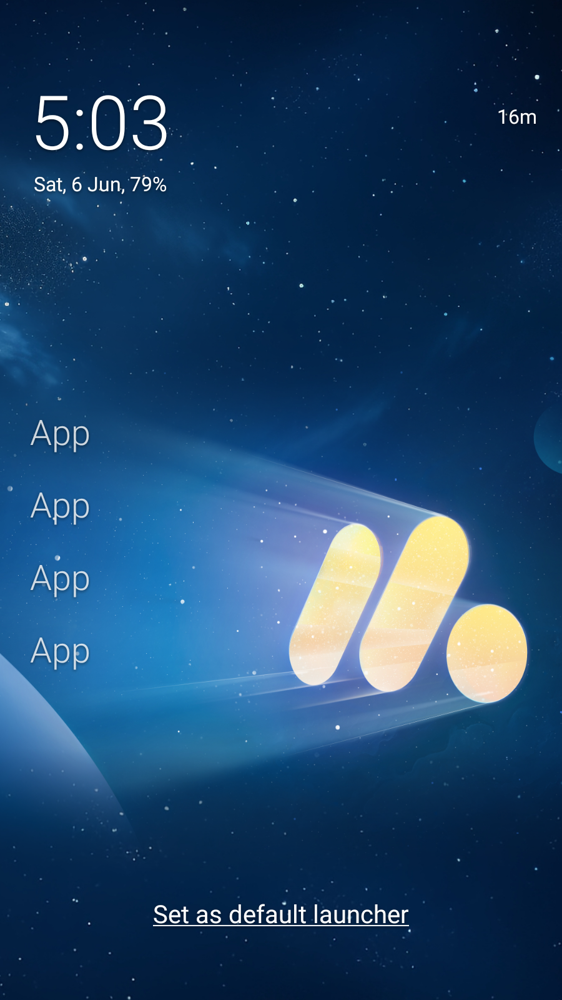
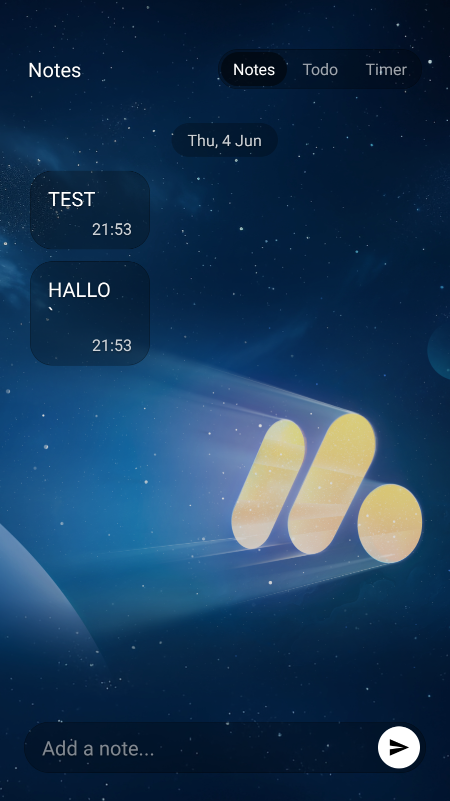
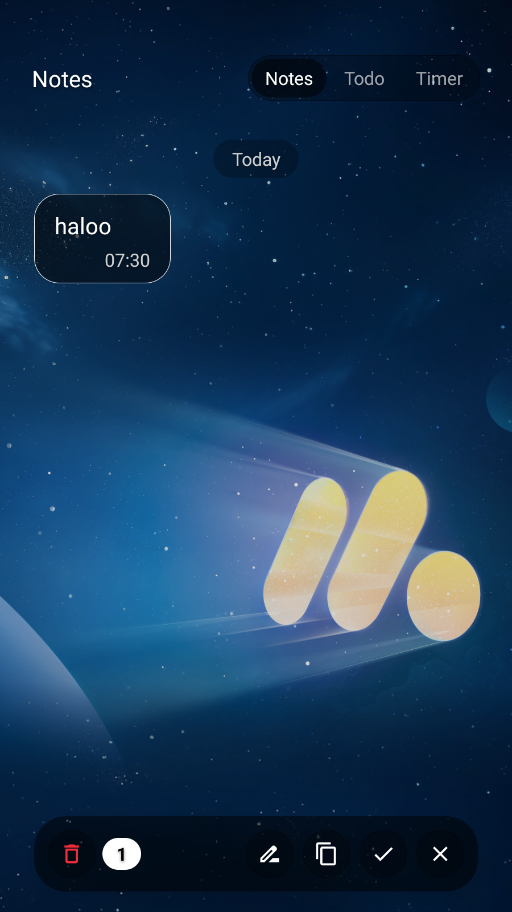
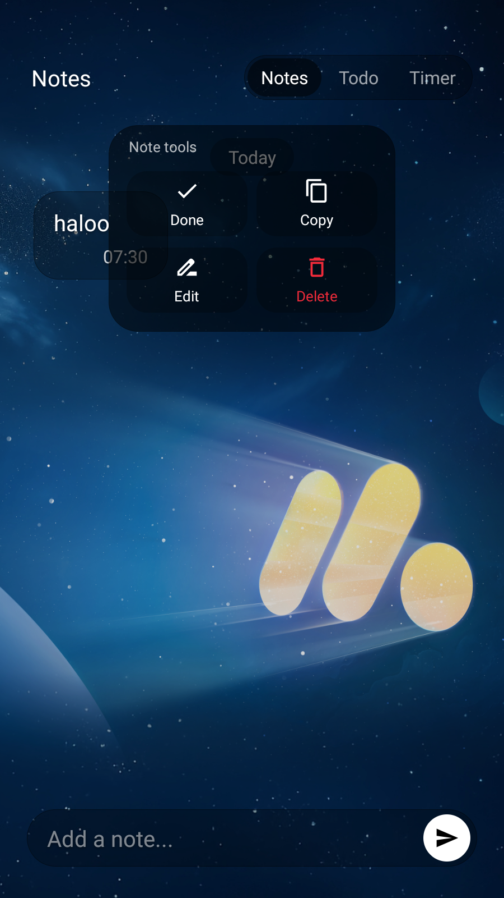
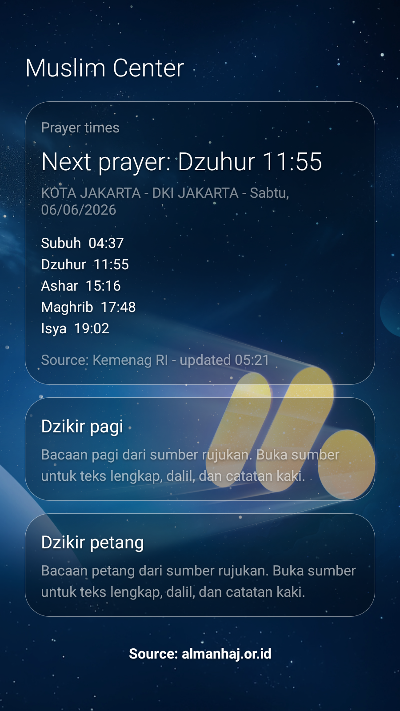
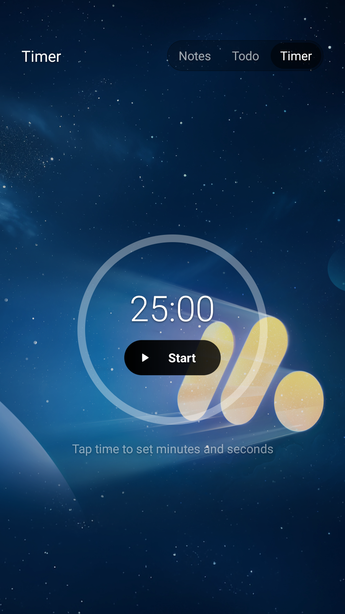

# Sakina Launcher

Minimal Android launcher with Muslim Center, notes, todos, and a calmer home screen. Same Olauncher spirit, more daily utility.

<p align="center">
  
</p>



---

## Table of Contents

- [Before You Start](#before-you-start)
- [Introduction](#introduction)
- [Preview](#preview)
- [What You Get](#what-you-get)
- [Install](#install)
- [Build From Source](#build-from-source)
- [Release APKs](#release-apks)
- [Project Structure](#project-structure)
- [Troubleshooting](#troubleshooting)
- [Credits](#credits)
- [License](#license)

---

## Before You Start

- Android 7.0 or newer is required.
- Set Sakina Launcher as the default launcher after installing.
- Usage Stats permission is optional, only needed for screen time.
- Location permission is optional, only needed for automatic prayer location.
- Release APKs are built by GitHub Actions when a `v*` tag is pushed.

> [!TIP]
> If Android blocks installation, enable **Install unknown apps** for the browser or file manager you use to open the APK.

---

## Introduction

Sakina Launcher is a fork-based Android launcher for people who want fewer distractions without losing useful daily tools. The home screen stays quiet. Notes, todos, focus timer, prayer times, and dhikr stay one gesture away.

The app is based on [Olauncher](https://github.com/tanujnotes/Olauncher) by [@tanujnotes](https://github.com/tanujnotes). Sakina keeps the privacy-first launcher foundation and adds Muslim Center plus productivity surfaces.

The README structure is inspired by [khushie09/fedorix](https://github.com/khushie09/fedorix): clear sections, preview-first documentation, setup notes, and credits in one place.

---

## Preview









---

## What You Get

### Quiet Launcher

- Minimal home screen with favorite apps.
- Swipe gestures for app drawer, notes, todos, timer, and Muslim Center.
- Optional screen time display.
- Hidden apps and app rename support.
- Light, dark, and system theme modes.

### Productive Panel

- Chat-style notes.
- Floating tap actions for delete, edit, copy, done, and close.
- Floating hold menu with a modern quick-action grid.
- Todo list with done state.
- Focus timer with circular progress.
- Smooth panel, list, and action transitions.

### Muslim Center

- Prayer times with Kemenag/MyQuran and Aladhan support.
- Manual city search or automatic location.
- Cached prayer schedule for offline use.
- Morning and evening dhikr cards.
- Built-in repetition counter.

### Privacy

- No ads.
- No analytics.
- No account.
- Data stays on device.

---

## Install

1. Open the latest [GitHub Release](https://github.com/Bsraccc1/Sakina-Launcher/releases).
2. Download `Sakina-Launcher-<version>.apk`.
3. Install the APK on your Android device.
4. Press Home and choose Sakina Launcher as default.

> [!NOTE]
> Debug builds use the package suffix `.debug`, so they can be installed next to release builds.

---

## Build From Source

Requirements:

- JDK 17
- Android SDK with compile SDK 35
- Gradle wrapper from this repository

Clone and build:

```bash
git clone https://github.com/Bsraccc1/Sakina-Launcher.git
cd Sakina-Launcher
./gradlew assembleDebug
```

Windows:

```powershell
.\gradlew.bat assembleDebug
```

Useful commands:

```bash
./gradlew testDebugUnitTest
./gradlew assembleDebug
./gradlew assembleRelease
./gradlew clean
```

---

## Release APKs

This repo includes a GitHub Actions release workflow:

- Pull requests and pushes build/test the app.
- Pushing a tag like `v6.5.0` builds a release APK.
- The workflow creates a GitHub Release and uploads the APK.
- Manual release builds are available from the Actions tab.

Create a release:

```bash
git tag v6.5.0
git push origin v6.5.0
```

The APK will appear in the release assets after the workflow finishes.

---

## Project Structure

```text
.
├── app/
│   ├── src/main/java/app/sakinalauncher/
│   │   ├── data/          # prefs, note store, models, prayer data
│   │   ├── helper/        # launcher, usage stats, wallpaper, location helpers
│   │   ├── listener/      # gestures and device admin
│   │   └── ui/            # fragments, adapters, custom views
│   └── src/main/res/      # layouts, drawables, strings, navigation, animations
├── Assets/screenshots/    # README screenshots
├── .github/workflows/     # CI and release APK workflow
└── README.md
```

| Area | Purpose |
| --- | --- |
| `HomeFragment` | Main launcher screen and gesture routing |
| `NotePanelFragment` | Notes, todos, timer, and chat actions |
| `MuslimCenterFragment` | Prayer schedule overview |
| `DhikrPagerFragment` | Swipeable dhikr cards |
| `SettingsFragment` | App settings and personalization |
| `NotePanelStore` | Local note and todo persistence |

---

## Troubleshooting

> [!NOTE]
> Start here before opening an issue.

**APK will not install**

Enable install permission for the app opening the APK, then try again.

**Launcher chooser does not appear**

Open Android Settings, search for **Default apps**, then choose Sakina Launcher under Home app.

**Prayer times do not load**

Check internet access, then set the city manually from Muslim Center.

**Screen time is empty**

Allow Usage Stats permission for Sakina Launcher in Android settings.

**Release workflow did not create an APK**

Make sure the pushed tag starts with `v`, for example `v6.5.0`.

---

## Credits

| Project or Source | Credit |
| --- | --- |
| [Olauncher](https://github.com/tanujnotes/Olauncher) | Original launcher foundation by [@tanujnotes](https://github.com/tanujnotes) |
| [Fedorix](https://github.com/khushie09/fedorix) | README format inspiration |
| [almanhaj.or.id](https://almanhaj.or.id) | Morning and evening dhikr content |
| Kemenag/MyQuran | Indonesia prayer time source |
| [Aladhan](https://aladhan.com/prayer-times-api) | Global prayer time source |

---

## License

GNU General Public License v3.0. See [LICENSE](LICENSE).

---

Built for a quieter phone, useful gestures, and daily remembrance.
