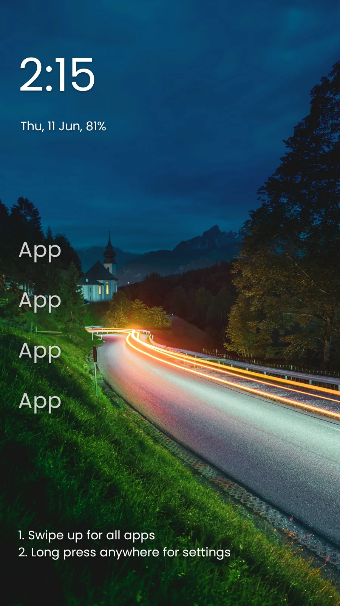
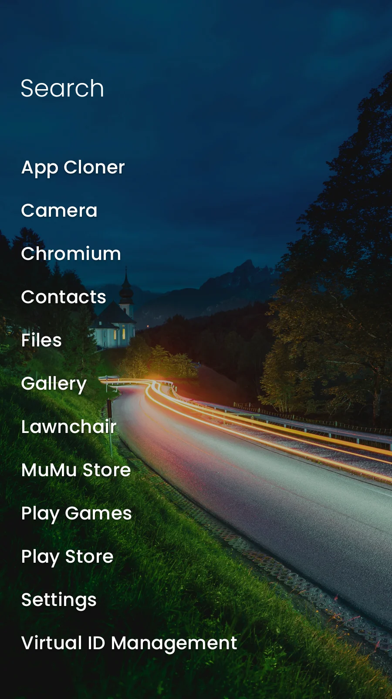
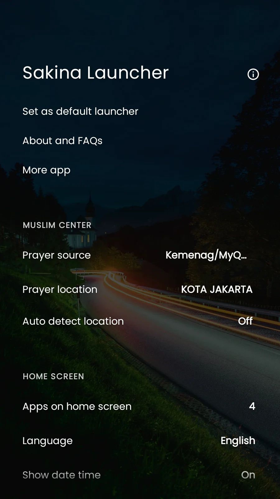
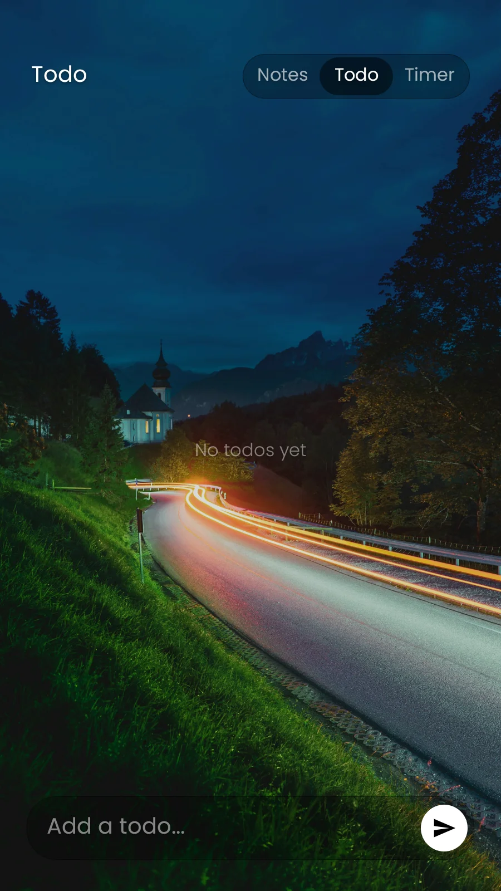
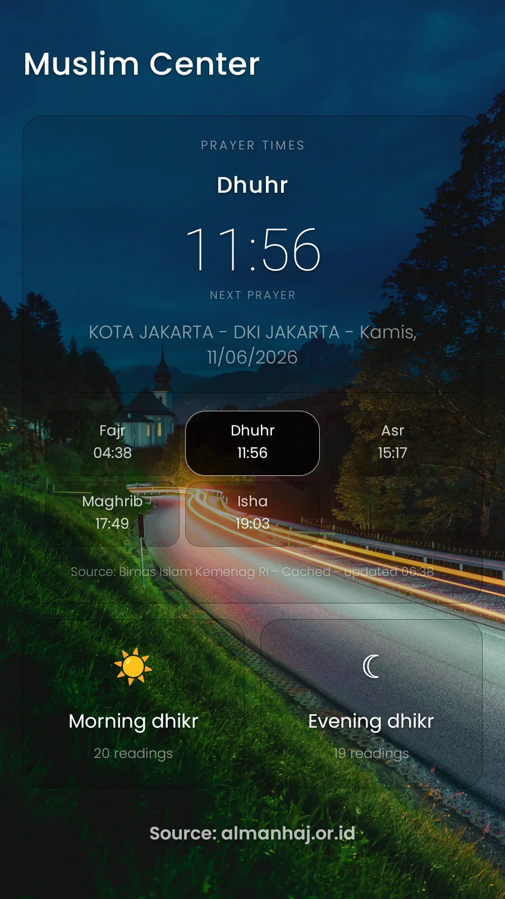
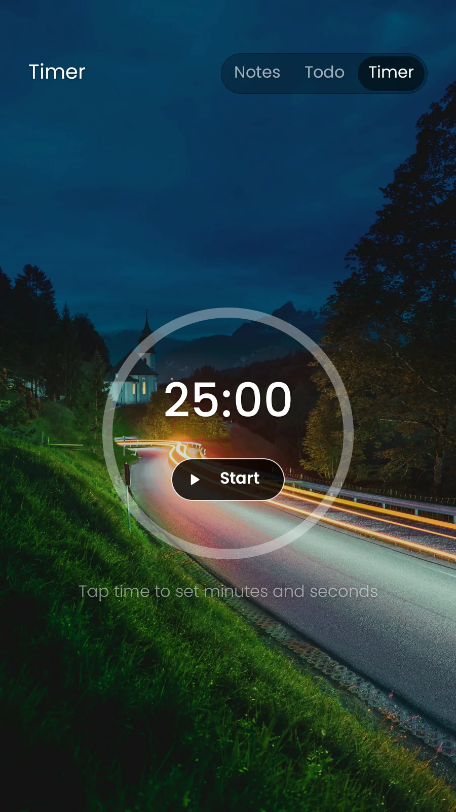

<div align="center">

# 🕌 Sakinah Launcher

### A minimal, distraction-free Android launcher with a calm Islamic heart ☪️

Quiet home screen. Prayer times, dzikir, notes, todos and a focus timer — all one gesture away.

<br/>


<br/><br/>


</div>

---

## 📑 Table of Contents

- [Introduction](#-introduction)
- [Features](#-features)
- [Preview / Screenshots](#-preview--screenshots)
- [Built With / Tech Stack](#-built-with--tech-stack)
- [Installation](#-installation)
- [Build From Source](#-build-from-source)
- [Verifying a Change](#-verifying-a-change)
- [Project Structure](#-project-structure)
- [Performance Notes](#-performance-notes)
- [Contributing](#-contributing)
- [Credits](#-credits)
- [License](#-license)

---

## 📖 Introduction

**Sakinah Launcher** is a minimal Islamic Android launcher built on top of
[Olauncher](https://github.com/tanujnotes/Olauncher). It keeps the privacy-first,
distraction-reducing home screen of Olauncher and layers a calmer set of daily utilities on
top — a **Muslim Center** with prayer times and dzikir, plus notes, todos and a focus timer.

The name *Sakinah* (سَكِينَة) means tranquillity. The whole launcher is designed around that
idea: a quiet text-only home screen, gestures instead of grids of icons, and the few tools
you actually open every day kept a single swipe away.

> [!NOTE]
> Sakinah is a fork-based project. The launcher foundation comes from
> [Olauncher](https://github.com/tanujnotes/Olauncher) by
> [@tanujnotes](https://github.com/tanujnotes). Sakinah adds the Muslim Center, the productive
> panel, custom fonts (Poppins + Amiri Quran) and a refreshed UI.

> [!TIP]
> After installing, press **Home** and choose **Sakinah Launcher** as your default launcher to
> get the full experience.

---

## ✨ Features

### 🌙 Quiet Launcher
- Minimal, text-first home screen with up to 8 favourite apps.
- Swipe gestures (left / right / down) mapped to apps, app drawer, notes, todos, timer and the Muslim Center.
- Hidden apps and app renaming.
- Light, dark and system theme modes; adaptive glass surfaces with real backdrop blur on Android 12+.
- Selectable UI typeface (System, Poppins, Outfit, Serif, Monospace) and a text-size scale.
- English / Indonesian in-app language switch.
- Optional screen-time display via Usage Stats.

### 🕋 Muslim Center
- Five daily prayer times (Fajr, Dhuhr, Asr, Maghrib, Isha).
- Indonesian source (Kemenag / MyQuran) and global source ([Aladhan](https://aladhan.com/prayer-times-api)).
- Manual city search or automatic location.
- **Fully offline schedule**: prayer times are computed on device for any date, so the card is
  never empty — the network is an optimisation, not a requirement.
- Morning, evening and after-prayer **dzikir** cards with a built-in tap repetition counter
  (Amiri Quran mushaf font for Arabic).

### 📝 Productive Panel
- Chat-style notes with floating tap actions (delete, edit, copy, done, close).
- Todo list with multi-select batch delete and done state.
- Focus / Pomodoro timer with circular progress.
- **Home-screen widgets**: a real `AppWidgetHost` tab — add any installed widget, drag to
  resize, reorder, remove.
- Per-module toggles, three panel sizes and a dialog-width scale in Settings.
- Keyboard-aware panel — rises above the IME, never hidden behind it.

### 🔒 Privacy
- No ads. No analytics. No account. Your data stays on the device.

> [!IMPORTANT]
> Usage Stats and Location permissions are **optional**. Usage Stats is only used for the
> screen-time display, and Location is only used to auto-detect your prayer-times city. The
> launcher works fully without granting either.

---

## 📸 Preview / Screenshots

<div align="center">

| Home | App Drawer | Settings | Todo | Muslim Center | Focus Timer |
| :---: | :---: | :---: | :---: | :---: | :---: |
|  |  |  |  |  |  |

</div>

---

## 🛠 Built With / Tech Stack

Sakina is a single-Activity Kotlin app (Navigation Component + ViewBinding). It stands on the
shoulders of several open-source projects and services — every one of them is credited below.

| Technology / Project | Version | Used For |
| --- | --- | --- |
| [Kotlin](https://kotlinlang.org/) | 2.1.20 | Primary language |
| [Android Gradle Plugin](https://developer.android.com/build) | 8.9.1 | Build system |
| [AndroidX Core KTX](https://developer.android.com/jetpack/androidx/releases/core) | 1.16.0 | Kotlin extensions for the framework |
| [AndroidX AppCompat](https://developer.android.com/jetpack/androidx/releases/appcompat) | 1.7.0 | Backwards-compatible UI |
| [AndroidX RecyclerView](https://developer.android.com/jetpack/androidx/releases/recyclerview) | 1.4.0 | App drawer, notes, prayer lists |
| [Material Components](https://github.com/material-components/material-components-android) | 1.12.0 | Material UI widgets |
| [AndroidX Lifecycle (ViewModel + Extensions)](https://developer.android.com/jetpack/androidx/releases/lifecycle) | 2.9.0 / 2.2.0 | `MainViewModel`, lifecycle-aware state |
| [AndroidX Navigation Component](https://developer.android.com/guide/navigation) | 2.9.0 | Fragment navigation graph |
| [AndroidX WorkManager](https://developer.android.com/jetpack/androidx/releases/work) | 2.10.1 | Daily wallpaper background work |
| [OkHttp](https://square.github.io/okhttp/) | 4.12.0 | HTTP client for prayer-time APIs |
| [Retrofit](https://square.github.io/retrofit/) | 2.11.0 | Type-safe REST client |
| [Gson (Retrofit converter)](https://github.com/google/gson) | via Retrofit 2.11.0 | JSON (de)serialization |
| [JUnit](https://junit.org/junit4/) | 4.13.2 | Unit testing |
| [org.json](https://github.com/stleary/JSON-java) | 20240303 | JSON parsing in tests |

**Foundation, fonts and data sources**

| Project / Source | Used For |
| --- | --- |
| [Olauncher](https://github.com/tanujnotes/Olauncher) | Launcher foundation this project is based on |
| [Poppins](https://fonts.google.com/specimen/Poppins) (Google Fonts) | Default Latin / UI typeface |
| [Outfit](https://fonts.google.com/specimen/Outfit) (Google Fonts) | Alternate UI typeface |
| [Amiri Quran](https://fonts.google.com/specimen/Amiri+Quran) | Arabic mushaf typeface for dzikir / Qur'an text |
| [Aladhan Prayer Times API](https://aladhan.com/prayer-times-api) | Global prayer-time source |
| Kemenag / [MyQuran API](https://api.myquran.com/) | Indonesia prayer-time source |

---

## 📥 Installation

The easiest way is to grab a prebuilt APK from the Releases page.

1. Open the latest [GitHub Release](https://github.com/Bsraccc1/Sakina-Launcher/releases).
2. Download `Sakinah-Launcher-<version>.apk`.
3. Install it on your Android 7.0+ device.
4. Press **Home** and select **Sakinah Launcher** as the default Home app.

> [!TIP]
> If Android blocks the install, enable **Install unknown apps** for the browser or file
> manager you used to open the APK.

> [!NOTE]
> Debug builds use the `app.sakinalauncher.debug` application id, so they install side-by-side
> with a release build.

### Automatic release (GitHub Actions)

Workflow: [`.github/workflows/release.yml`](.github/workflows/release.yml)

| How | What happens |
| --- | --- |
| Push a tag `v*` | e.g. `git tag v6.6.1 && git push origin v6.6.1` → build + GitHub Release |
| **Actions → Release APK → Run workflow** | Manual release; optional custom tag / pre-release |

The workflow runs unit tests, builds `assembleRelease`, and uploads the APK to [Releases](https://github.com/Bsraccc1/Sakina-Launcher/releases).

---

## 🧰 Build From Source

**Requirements**

- JDK 17 or newer (JDK 21 works)
- Android SDK with compile SDK 36
- The Gradle wrapper bundled in this repo (no separate Gradle install needed)

**Clone and build**

```bash
git clone https://github.com/Bsraccc1/Sakina-Launcher.git
cd Sakina-Launcher
./gradlew assembleDebug
```

**Windows**

```powershell
.\gradlew.bat assembleDebug
```

**Useful commands**

```bash
./gradlew assembleDebug      # debug APK (~9 MB, unminified)
./gradlew assembleRelease    # release APK (~2.7 MB, R8-minified + resource-shrunk)
./gradlew installDebug       # build + install to a connected device
./gradlew testDebugUnitTest  # JVM unit tests
./gradlew lint               # static analysis report
./gradlew clean              # clean build outputs
```

Output APKs land in `app/build/outputs/apk/`.

> [!IMPORTANT]
> Pushing a git tag like `v6.5.0` triggers the [release workflow](.github/workflows/release.yml),
> which builds the APK and publishes it to GitHub Releases as `Sakina-Launcher-<version>.apk`.

---

## 🔬 Verifying a Change

A launcher replaces the home screen, so a regression is not a bug in a screen the user can
avoid — it is the phone. Anything touching the render path, the widget host or the app drawer
should be checked on a device or emulator, not only compiled.

**1. Unit tests** cover the pure logic: prayer-time arithmetic, the offline schedule
guarantee, the note/todo codec, widget size maths and dzikir content.

```bash
./gradlew testDebugUnitTest
```

**2. Install on a device or emulator and set it as the default launcher.** The launcher
behaves differently when it *is* Home — the system composites the wallpaper behind the window
instead of the app drawing it.

```bash
./gradlew installDebug
adb shell input keyevent KEYCODE_HOME    # then pick Sakinah Launcher
```

**3. Walk the surfaces that own their own view lifecycle.** These are the ones where a
change is most likely to show up:

| Surface | How to reach it | What to look for |
| --- | --- | --- |
| App drawer | Swipe up on home | Rows scroll cleanly; long-press opens the menu; rename, hide, unhide, search all work |
| Settings pickers | Long-press home | Each row expands its inline picker (apps count, date/time, alignment, theme, text size, gestures) |
| Productive panel | Swipe left/right (per your gesture setting) | Notes / Todo / Timer / Widgets tabs switch without the widget rebuilding or flickering |
| Widget tab | Productive → Widgets | Add, long-press to edit, drag-resize, reorder, remove; the size survives leaving and returning |
| Muslim Center | Swipe left/right (per your gesture setting) | Prayer card populates offline; dzikir reader tabs and paging work |

**4. Check for crashes and dropped frames.**

```bash
adb logcat -c && adb logcat -d | grep -c 'FATAL EXCEPTION'   # must be 0

adb shell dumpsys gfxinfo app.sakinalauncher.debug reset
# ...exercise the drawer / panel...
adb shell dumpsys gfxinfo app.sakinalauncher.debug | grep -E 'Janky|percentile|attached Views'
```

`Total attached Views` is the cheapest signal for layout regressions — if a per-row view
count grows, the drawer will feel it long before a profiler says so.

---

## 🗂 Project Structure

```text
Sakina-Launcher/
├── app/
│   └── src/main/
│       ├── java/app/sakinalauncher/
│       │   ├── data/            # Prefs, Constants, models, note store
│       │   │   └── muslim/      # prayer API, repository, store, models
│       │   ├── helper/          # Utils, FontHelper, wallpaper, usage stats, dialogs
│       │   ├── listener/        # swipe gesture + device admin listeners
│       │   ├── ui/              # fragments, adapters, custom views
│       │   ├── MainActivity.kt  # single entry point / nav host
│       │   └── MainViewModel.kt # shared ViewModel
│       └── res/                 # layouts, drawables, fonts, strings, navigation, anims
├── Assets/
│   ├── branding/ic_launcher.png # App logo (سكينة + crescent)
│   └── screenshots/             # README screenshots (WebP)
├── docs/branding/               # Logo source + PNG export
├── .github/workflows/           # CI + release-APK workflows
├── ARCHITECTURE_REVIEW.md       # architecture deepening notes
├── CONTEXT.md                   # domain glossary
└── README.md
```

| Module | Responsibility |
| --- | --- |
| `MainActivity` | Hosts the nav graph, wallpaper layer, theme/restart bookkeeping |
| `MainViewModel` | App list loading, hidden/private-space filtering, usage stats, wallpaper worker |
| `HomeFragment` | Main launcher screen + gesture routing |
| `AppDrawerFragment` | Full app list, search, long-press menu, rename / hide |
| `NotePanelFragment` | Notes, todos, focus timer, widget tab |
| `MuslimCenterFragment` | Prayer schedule overview |
| `DhikrPagerFragment` | Swipeable dzikir cards + repetition counter |
| `SettingsFragment` | App settings and personalisation |
| `data/Prefs.kt` | Single typed `SharedPreferences` store for all settings |
| `helper/ProductiveWidgetHostHelper.kt` | `AppWidgetHost` lifecycle, widget cards, resize / reorder |
| `data/muslim/PrayerTimeRepository.kt` | Prayer schedule: on-device computation first, network second |

---

## ⚡ Performance Notes

A launcher is measured on the frame it does not drop. The costly work here is not the
arithmetic, it is view construction and binder traffic on paths that run on every Home press.
The patterns below are load-bearing — reverting one will show up as jank, not as a test
failure:

| Pattern | Where | Why |
| --- | --- | --- |
| Long-press menu and rename row behind `ViewStub`s | `adapter_app_drawer.xml` | A drawer row the user only scrolls past constructs 3 views instead of 13, `AppCompatEditText` included |
| Render-signature short-circuit before rebuilding the widget flow | `ProductiveWidgetHostHelper.inflateInto` | Every panel render used to tear down live `AppWidgetHostView`s and re-inflate RemoteViews trees from other processes to reproduce an identical result |
| Resize drags coalesced to one layout pass per frame | `ResizableWidgetFrame.applyLiveSize` | A 120 Hz digitizer delivers up to 120 moves a second, each one re-measuring every hosted widget |
| One bulk `getInstalledPackages` instead of per-app `firstInstallTime` | `helper/Utils.kt` | The "new app" marker cost one binder round-trip per app — hundreds on a full drawer load |
| Pre-built `CollationKey`s, sort via `AppModel.compareTo` | `helper/Utils.kt`, `data/AppModel.kt` | Comparison becomes a byte-array compare instead of a fresh `Collator` pass, O(n) setup instead of O(n log n) collation |
| Cached normalized labels + compiled regexes in drawer search | `AppDrawerAdapter` | Filtering rebuilt two `Regex` objects and re-ran `Normalizer` for every app on every keystroke |
| Wallpaper decoded off the main thread, downsampled to the screen | `MainActivity.decodeUserWallpaper` | A photo wallpaper decoded a multi-megabyte bitmap on the launch critical path |
| Prayer schedules computed on demand, cache warmed to the store's retention window | `PrayerTimeRepository` | Warming a year wrote ~175 KB of JSON and then deleted most of it; the offline guarantee comes from computation, not from the cache |
| Long-press callbacks posted to the view, not a `Handler` | `listener/*SwipeTouchListener.kt` | A Handler message keeps the view, its Context and the fragment reachable after detach; `View.postDelayed` is cancelled on detach |

Measured on an Android 16 emulator (1080×2400), debug build, app drawer open with 14 rows
visible, comparing `v6.6.3` against the current tree:

| Metric | Before | After |
| --- | --- | --- |
| Attached views | 217 | 105 |
| Render nodes | 296 kB | 155 kB |

These two are exact and reproducible across cold boots. Frame-time percentiles are **not**
reported here: on this emulator they swing by a factor of three between identical runs, and
alternating the two builds put them inside that noise. Judge layout changes by view and
render-node count, and frame timing on real hardware.

---

## 🤝 Contributing

Contributions are welcome.

1. Fork the repository and create a feature branch (`feature/my-change`).
2. Keep the existing Kotlin style; use ViewBinding (no `findViewById`).
3. Make sure `./gradlew testDebugUnitTest`, `./gradlew assembleDebug` and `./gradlew lint`
   pass, and walk the [verification checklist](#-verifying-a-change) for anything touching
   the drawer, the widget host or the render path.
4. Open a pull request describing the change and how you tested it.

> [!TIP]
> See `CONTEXT.md` for the domain glossary and `ARCHITECTURE_REVIEW.md` for known refactoring
> opportunities before starting larger work. `AGENTS.md` holds the same guidance for coding
> agents.

---

## 🙏 Credits

| Tool / Project | Author / Source |
| --- | --- |
| [Olauncher](https://github.com/tanujnotes/Olauncher) | [@tanujnotes](https://github.com/tanujnotes) — launcher foundation |
| [Kotlin](https://kotlinlang.org/) | JetBrains |
| [AndroidX / Jetpack](https://developer.android.com/jetpack) (Core, AppCompat, RecyclerView, Lifecycle, Navigation, WorkManager) | Google / Android Open Source Project |
| [Material Components for Android](https://github.com/material-components/material-components-android) | Google |
| [OkHttp](https://square.github.io/okhttp/) | Square |
| [Retrofit](https://square.github.io/retrofit/) | Square |
| [Gson](https://github.com/google/gson) | Google |
| [JUnit](https://junit.org/junit4/) | JUnit Team |
| [org.json (JSON-java)](https://github.com/stleary/JSON-java) | Sean Leary |
| [Poppins font](https://fonts.google.com/specimen/Poppins) | Indian Type Foundry (Google Fonts, OFL) |
| [Outfit font](https://fonts.google.com/specimen/Outfit) | Smartsheet Inc. (Google Fonts, OFL) |
| [Amiri Quran font](https://fonts.google.com/specimen/Amiri+Quran) | Khaled Hosny (Google Fonts, OFL) |
| [Aladhan Prayer Times API](https://aladhan.com/prayer-times-api) | Islamic Network |
| [MyQuran / Kemenag API](https://api.myquran.com/) | MyQuran (Kemenag RI prayer schedule) |
| [almanhaj.or.id](https://almanhaj.or.id) | Morning & evening dzikir content reference |
| [fedorix](https://github.com/khushie09/fedorix) | README layout inspiration |

---

## 📄 License

Distributed under the **GNU General Public License v3.0**. See [LICENSE](LICENSE) for details.

<div align="center">

Built for a quieter phone, useful gestures, and daily remembrance. 🤲

</div>
